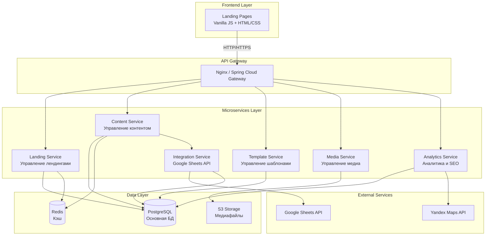

# Проект: Klassifikator - Система Управления Лендингами

## 📋 Оглавление
1. [Общее описание](#общее-описание)
2. [Цели и задачи проекта](#цели-и-задачи-проекта)
3. [Архитектура системы](#архитектура-системы)
4. [Технологический стек](#технологический-стек)
5. [Функциональные требования](#функциональные-требования)
6. [Нефункциональные требования](#нефункциональные-требования)
7. [Структура базы данных](#структура-базы-данных)
8. [API спецификация](#api-спецификация)
9. [Безопасность](#безопасность)
10. [Этапы разработки](#этапы-разработки)
11. [Стандарты разработки](#стандарты-разработки)

---

## Общее описание

**Klassifikator** - это платформа для массового создания и управления лендингами организаций на поддоменах второго уровня (например, `modernissimo.volzhck.ru`). Система позволяет:

- Автоматически создавать лендинги по шаблонам
- Управлять контентом через Google Таблицы
- Динамически обновлять данные на лендингах
- Хранить медиафайлы в S3-совместимом хранилище
- Поддерживать каталоги товаров
- Обеспечивать SEO-оптимизацию и адаптивную верстку

### Ключевые особенности
- **Масштабируемость**: микросервисная архитектура
- **Гибкость**: смена шаблонов без потери данных
- **Удобство**: управление через Google Sheets
- **Производительность**: кэширование и оптимизация запросов
- **SEO**: оптимизация для поисковых систем

---

## Цели и задачи проекта

### Бизнес-цели
1. Создание платформы для быстрого запуска лендингов организаций
2. Минимизация времени на создание и обновление контента
3. Централизованное управление множеством лендингов
4. Снижение технического порога для управления контентом

### Технические задачи
1. Разработка микросервисной архитектуры на Spring Boot
2. Интеграция с Google Sheets API
3. Реализация системы шаблонов лендингов
4. Организация хранения медиафайлов в S3
5. Обеспечение высокой производительности и безопасности
6. Реализация SEO-оптимизации
7. Создание адаптивной верстки для мобильных устройств

---

## Архитектура системы

### Общая архитектура



### Микросервисы

#### 1. **Landing Service** (Сервис управления лендингами)
**Ответственность:**
- Создание и удаление лендингов
- Привязка доменов к организациям
- Управление статусом лендингов
- Роутинг запросов к соответствующим лендингам

**Основные эндпоинты:**
- `POST /api/v1/landings` - создание лендинга
- `GET /api/v1/landings/{domain}` - получение данных лендинга
- `PUT /api/v1/landings/{id}` - обновление лендинга
- `DELETE /api/v1/landings/{id}` - удаление лендинга

#### 2. **Content Service** (Сервис управления контентом)
**Ответственность:**
- Хранение и управление контентом организаций
- Синхронизация с Google Sheets
- Версионирование контента
- Кэширование данных

**Основные эндпоинты:**
- `GET /api/v1/content/{organizationId}` - получение контента
- `PUT /api/v1/content/{organizationId}` - обновление контента
- `POST /api/v1/content/sync/{organizationId}` - синхронизация с Google Sheets

#### 3. **Template Service** (Сервис управления шаблонами)
**Ответственность:**
- Управление шаблонами лендингов
- Версионирование шаблонов
- Рендеринг страниц с данными
- Поддержка блоков (каталог, отзывы, карта и т.д.)

**Основные эндпоинты:**
- `GET /api/v1/templates` - список шаблонов
- `POST /api/v1/templates` - создание шаблона
- `GET /api/v1/templates/{id}/render` - рендеринг шаблона

#### 4. **Integration Service** (Сервис интеграций)
**Ответственность:**
- Интеграция с Google Sheets API
- Парсинг данных из таблиц
- Валидация данных
- Обработка webhook от Google

**Основные эндпоинты:**
- `POST /api/v1/integrations/google-sheets/sync` - синхронизация
- `POST /api/v1/integrations/google-sheets/webhook` - webhook обработчик

#### 5. **Media Service** (Сервис управления медиа)
**Ответственность:**
- Загрузка файлов в S3
- Оптимизация изображений
- Генерация thumbnails
- CDN интеграция

**Основные эндпоинты:**
- `POST /api/v1/media/upload` - загрузка файла
- `GET /api/v1/media/{organizationId}/{filename}` - получение файла
- `DELETE /api/v1/media/{id}` - удаление файла

#### 6. **Analytics Service** (Сервис аналитики)
**Ответственность:**
- SEO метаданные
- Генерация sitemap.xml
- Robots.txt
- Отслеживание посещений (опционально)

**Основные эндпоинты:**
- `GET /api/v1/analytics/seo/{domain}` - SEO данные
- `GET /api/v1/analytics/sitemap` - генерация sitemap

---

## Технологический стек

### Backend
- **Framework**: Spring Boot 3.2+
- **Language**: Java 17+
- **Build Tool**: Gradle
- **Database**: PostgreSQL 15+
- **Cache**: Redis 7+
- **Message Queue**: RabbitMQ / Apache Kafka (для асинхронной обработки)
- **Storage**: S3-совместимое хранилище (MinIO / AWS S3)
- **API Gateway**: Spring Cloud Gateway
- **Service Discovery**: Spring Cloud Netflix Eureka (опционально)
- **Configuration**: Spring Cloud Config

### Frontend (Landing Pages)
- **Core**: Vanilla JavaScript (ES6+)
- **Styling**: CSS3 с Media Queries
- **Build**: Webpack / Vite
- **Template Engine**: Thymeleaf (серверный рендеринг) или клиентский JS
- **Icons**: Font Awesome / Custom SVG
- **Maps**: Yandex Maps API

### DevOps & Infrastructure
- **Containerization**: Docker
- **Orchestration**: Docker Compose / Kubernetes
- **CI/CD**: GitHub Actions / GitLab CI
- **Monitoring**: Prometheus + Grafana
- **Logging**: ELK Stack (Elasticsearch, Logstash, Kibana)
- **Reverse Proxy**: Nginx

### External Integrations
- **Google Sheets API v4**
- **Yandex Maps API**
- **Review Plugins** (опционально)

---

## Функциональные требования

### FR-1: Управление лендингами

#### FR-1.1: Создание лендинга
- Система должна позволять создавать лендинг с указанием:
  - Поддомена (например, `modernissimo.volzhck.ru`)
  - ID организации
  - ID шаблона
  - ID Google Sheets таблицы
- Автоматическая настройка DNS (или инструкция для ручной настройки)
- Генерация SSL сертификата (Let's Encrypt)

#### FR-1.2: Массовое создание
- Импорт списка организаций из CSV/Excel
- Автоматическое создание лендингов по списку
- Валидация доменных имен

#### FR-1.3: Управление статусом
- Статусы: `DRAFT`, `ACTIVE`, `INACTIVE`, `ARCHIVED`
- Возможность активации/деактивации лендинга

### FR-2: Управление контентом

#### FR-2.1: Синхронизация с Google Sheets
- Автоматическая синхронизация при изменении таблицы (webhook)
- Ручная синхронизация по запросу
- Маппинг колонок таблицы на поля контента:
  - Название
  - Категория
  - Тип
  - Адрес
  - Телефон
  - Сайт/Соцсети
  - Режим работы
  - Статус
  - Домен
  - Title (SEO)
  - Description (SEO)
  - H1
  - Отзывы
  - О нас
  - Акции с картинкой
  - Товары/каталог
  - Фото
  - Контакты

#### FR-2.2: Версионирование контента
- Сохранение истории изменений
- Возможность отката к предыдущей версии

#### FR-2.3: Валидация данных
- Проверка обязательных полей
- Валидация форматов (телефон, URL, email)
- Проверка уникальности доменов

### FR-3: Управление шаблонами

#### FR-3.1: Создание и редактирование шаблонов
- HTML/CSS/JS структура
- Система блоков (компонентов)
- Переменные для подстановки данных

#### FR-3.2: Блоки шаблона
Обязательные блоки:
- **Header**: логотип, название, контакты
- **Hero Section**: главный баннер с H1
- **About**: блок "О нас"
- **Catalog**: каталог товаров (опционально)
- **Reviews**: блок отзывов
- **Promotions**: акции с изображениями
- **Gallery**: фотогалерея
- **Contacts**: контакты + карта
- **Footer**: подвал с дополнительной информацией

#### FR-3.3: Смена шаблона
- Возможность изменить шаблон без потери данных
- Автоматический маппинг данных на новый шаблон
- Preview перед применением

### FR-4: Управление медиафайлами

#### FR-4.1: Загрузка файлов
- Поддержка форматов: JPG, PNG, WebP, SVG
- Автоматическая оптимизация изображений
- Генерация thumbnails разных размеров

#### FR-4.2: Организация хранения
- Структура: `s3://bucket/{organizationId}/{category}/{filename}`
- Категории: `logo`, `hero`, `gallery`, `products`, `promotions`

#### FR-4.3: CDN интеграция
- Раздача файлов через CDN
- Кэширование на уровне CDN

### FR-5: SEO оптимизация

#### FR-5.1: Метаданные
- Динамическая генерация Title, Description
- Open Graph теги
- Schema.org разметка (LocalBusiness)
- Canonical URL

#### FR-5.2: Техническое SEO
- Генерация sitemap.xml
- Robots.txt
- Оптимизация скорости загрузки
- Lazy loading изображений
- Минификация CSS/JS

#### FR-5.3: Контентное SEO
- Правильная структура заголовков (H1-H6)
- Alt-теги для изображений
- Семантическая HTML разметка

### FR-6: Адаптивная верстка

#### FR-6.1: Breakpoints
- Mobile: 320px - 767px
- Tablet: 768px - 1023px
- Desktop: 1024px+

#### FR-6.2: Оптимизация для мобильных
- Touch-friendly элементы
- Оптимизированные изображения
- Быстрая загрузка

---

## Нефункциональные требования

### NFR-1: Производительность
- **Время отклика API**: < 200ms (95 percentile)
- **Время загрузки лендинга**: < 2 секунды (3G соединение)
- **Throughput**: 1000 RPS на микросервис
- **Время синхронизации с Google Sheets**: < 5 секунд

### NFR-2: Масштабируемость
- Горизонтальное масштабирование микросервисов
- Поддержка до 10,000 активных лендингов
- Обработка до 100,000 запросов в минуту

### NFR-3: Доступность (Availability)
- Uptime: 99.9% (SLA)
- Graceful degradation при недоступности внешних сервисов
- Health checks для всех микросервисов

### NFR-4: Безопасность
- HTTPS для всех соединений
- OAuth 2.0 для аутентификации API
- Rate limiting для API
- SQL injection защита
- XSS защита
- CORS настройки
- Шифрование чувствительных данных в БД

### NFR-5: Мониторинг и логирование
- Централизованное логирование
- Метрики производительности
- Алерты при критических ошибках
- Distributed tracing

### NFR-6: Поддерживаемость
- Код покрытие тестами: > 80%
- Документация API (OpenAPI/Swagger)
- Понятная структура кода
- Соблюдение SOLID принципов

---

## Структура базы данных

### Схема PostgreSQL

```sql
-- Организации
CREATE TABLE organizations (
    id BIGSERIAL PRIMARY KEY,
    name VARCHAR(255) NOT NULL,
    category VARCHAR(100),
    type VARCHAR(100),
    address TEXT,
    phone VARCHAR(50),
    website VARCHAR(255),
    working_hours TEXT,
    status VARCHAR(50) DEFAULT 'ACTIVE',
    google_sheet_id VARCHAR(255),
    created_at TIMESTAMP DEFAULT CURRENT_TIMESTAMP,
    updated_at TIMESTAMP DEFAULT CURRENT_TIMESTAMP
);

-- Лендинги
CREATE TABLE landings (
    id BIGSERIAL PRIMARY KEY,
    organization_id BIGINT NOT NULL REFERENCES organizations(id) ON DELETE CASCADE,
    domain VARCHAR(255) UNIQUE NOT NULL,
    subdomain VARCHAR(255) UNIQUE NOT NULL,
    template_id BIGINT REFERENCES templates(id),
    status VARCHAR(50) DEFAULT 'DRAFT',
    ssl_enabled BOOLEAN DEFAULT FALSE,
    created_at TIMESTAMP DEFAULT CURRENT_TIMESTAMP,
    updated_at TIMESTAMP DEFAULT CURRENT_TIMESTAMP,
    published_at TIMESTAMP,
    INDEX idx_domain (domain),
    INDEX idx_organization (organization_id)
);

-- Шаблоны
CREATE TABLE templates (
    id BIGSERIAL PRIMARY KEY,
    name VARCHAR(255) NOT NULL,
    description TEXT,
    version VARCHAR(50),
    html_structure TEXT,
    css_styles TEXT,
    js_scripts TEXT,
    config JSONB,
    is_active BOOLEAN DEFAULT TRUE,
    created_at TIMESTAMP DEFAULT CURRENT_TIMESTAMP,
    updated_at TIMESTAMP DEFAULT CURRENT_TIMESTAMP
);

-- Контент организаций
CREATE TABLE organization_content (
    id BIGSERIAL PRIMARY KEY,
    organization_id BIGINT NOT NULL REFERENCES organizations(id) ON DELETE CASCADE,
    title VARCHAR(255),
    meta_description TEXT,
    h1 VARCHAR(255),
    about_text TEXT,
    content_data JSONB,
    version INT DEFAULT 1,
    created_at TIMESTAMP DEFAULT CURRENT_TIMESTAMP,
    updated_at TIMESTAMP DEFAULT CURRENT_TIMESTAMP,
    INDEX idx_organization (organization_id)
);

-- История версий контента
CREATE TABLE content_versions (
    id BIGSERIAL PRIMARY KEY,
    organization_content_id BIGINT REFERENCES organization_content(id) ON DELETE CASCADE,
    version INT NOT NULL,
    content_data JSONB,
    changed_by VARCHAR(255),
    created_at TIMESTAMP DEFAULT CURRENT_TIMESTAMP
);

-- Медиафайлы
CREATE TABLE media_files (
    id BIGSERIAL PRIMARY KEY,
    organization_id BIGINT NOT NULL REFERENCES organizations(id) ON DELETE CASCADE,
    filename VARCHAR(255) NOT NULL,
    original_filename VARCHAR(255),
    file_path VARCHAR(500) NOT NULL,
    file_size BIGINT,
    mime_type VARCHAR(100),
    category VARCHAR(50),
    width INT,
    height INT,
    created_at TIMESTAMP DEFAULT CURRENT_TIMESTAMP,
    INDEX idx_organization (organization_id),
    INDEX idx_category (category)
);

-- Товары/Каталог
CREATE TABLE products (
    id BIGSERIAL PRIMARY KEY,
    organization_id BIGINT NOT NULL REFERENCES organizations(id) ON DELETE CASCADE,
    name VARCHAR(255) NOT NULL,
    description TEXT,
    price DECIMAL(10, 2),
    image_id BIGINT REFERENCES media_files(id),
    is_active BOOLEAN DEFAULT TRUE,
    sort_order INT DEFAULT 0,
    created_at TIMESTAMP DEFAULT CURRENT_TIMESTAMP,
    updated_at TIMESTAMP DEFAULT CURRENT_TIMESTAMP,
    INDEX idx_organization (organization_id)
);

-- Отзывы
CREATE TABLE reviews (
    id BIGSERIAL PRIMARY KEY,
    organization_id BIGINT NOT NULL REFERENCES organizations(id) ON DELETE CASCADE,
    author_name VARCHAR(255),
    rating INT CHECK (rating >= 1 AND rating <= 5),
    text TEXT,
    is_approved BOOLEAN DEFAULT FALSE,
    created_at TIMESTAMP DEFAULT CURRENT_TIMESTAMP,
    INDEX idx_organization (organization_id)
);

-- Акции
CREATE TABLE promotions (
    id BIGSERIAL PRIMARY KEY,
    organization_id BIGINT NOT NULL REFERENCES organizations(id) ON DELETE CASCADE,
    title VARCHAR(255) NOT NULL,
    description TEXT,
    image_id BIGINT REFERENCES media_files(id),
    start_date DATE,
    end_date DATE,
    is_active BOOLEAN DEFAULT TRUE,
    created_at TIMESTAMP DEFAULT CURRENT_TIMESTAMP,
    updated_at TIMESTAMP DEFAULT CURRENT_TIMESTAMP,
    INDEX idx_organization (organization_id),
    INDEX idx_dates (start_date, end_date)
);

-- Синхронизация с Google Sheets
CREATE TABLE google_sheets_sync (
    id BIGSERIAL PRIMARY KEY,
    organization_id BIGINT REFERENCES organizations(id) ON DELETE CASCADE,
    sheet_id VARCHAR(255) NOT NULL,
    last_sync_at TIMESTAMP,
    sync_status VARCHAR(50),
    error_message TEXT,
    created_at TIMESTAMP DEFAULT CURRENT_TIMESTAMP,
    INDEX idx_organization (organization_id)
);

-- SEO данные
CREATE TABLE seo_data (
    id BIGSERIAL PRIMARY KEY,
    landing_id BIGINT NOT NULL REFERENCES landings(id) ON DELETE CASCADE,
    title VARCHAR(255),
    meta_description TEXT,
    meta_keywords TEXT,
    og_title VARCHAR(255),
    og_description TEXT,
    og_image VARCHAR(500),
    schema_markup JSONB,
    created_at TIMESTAMP DEFAULT CURRENT_TIMESTAMP,
    updated_at TIMESTAMP DEFAULT CURRENT_TIMESTAMP,
    INDEX idx_landing (landing_id)
);
```

---

## API Спецификация

### Базовый URL
```
https://api.volzhck.ru/api/v1
```

### Аутентификация
```
Authorization: Bearer {JWT_TOKEN}
```

### Основные эндпоинты

#### Landing Service

**Создание лендинга**
```http
POST /landings
Content-Type: application/json

{
  "organizationId": 1,
  "subdomain": "modernissimo",
  "templateId": 1,
  "googleSheetId": "1KS2TOS5ZKxONDmUaVoiwb3tyu3Y1DlGQaME2KM4vItQ"
}

Response 201:
{
  "id": 1,
  "domain": "modernissimo.volzhck.ru",
  "status": "DRAFT",
  "createdAt": "2025-11-02T10:00:00Z"
}
```

**Получение лендинга**
```http
GET /landings/{id}

Response 200:
{
  "id": 1,
  "organizationId": 1,
  "domain": "modernissimo.volzhck.ru",
  "templateId": 1,
  "status": "ACTIVE",
  "sslEnabled": true
}
```

#### Content Service

**Получение контента организации**
```http
GET /content/{organizationId}

Response 200:
{
  "organizationId": 1,
  "title": "Модернissimo - Современная мебель",
  "metaDescription": "...",
  "h1": "Модернissimo",
  "about": "...",
  "products": [...],
  "reviews": [...],
  "promotions": [...]
}
```

**Синхронизация с Google Sheets**
```http
POST /content/sync/{organizationId}

Response 200:
{
  "status": "SUCCESS",
  "syncedAt": "2025-11-02T10:00:00Z",
  "changesCount": 5
}
```

---

## Безопасность

### Уровни безопасности

#### 1. Сетевой уровень
- Firewall правила
- DDoS защита
- Rate limiting на уровне Nginx

#### 2. Аутентификация и авторизация
- JWT токены для API
- OAuth 2.0 для интеграций
- Role-Based Access Control (RBAC)

#### 3. Защита данных
- Шифрование паролей (BCrypt)
- Шифрование чувствительных данных в БД
- HTTPS для всех соединений
- Secure cookies

#### 4. Защита от атак
- SQL Injection: использование PreparedStatement
- XSS: санитизация входных данных
- CSRF: токены для форм
- CORS: настройка разрешенных источников

#### 5. Мониторинг безопасности
- Логирование всех попыток доступа
- Алерты при подозрительной активности
- Регулярные security audits

---

## Этапы разработки

### Фаза 1: Инфраструктура и базовые сервисы (4 недели)

#### Неделя 1-2: Настройка инфраструктуры
- [ ] Настройка проекта Spring Boot
- [ ] Конфигурация PostgreSQL
- [ ] Настройка Redis
- [ ] Настройка S3 хранилища
- [ ] Docker Compose для локальной разработки
- [ ] CI/CD pipeline

#### Неделя 3-4: Базовые микросервисы
- [ ] Landing Service (базовый CRUD)
- [ ] Content Service (базовый CRUD)
- [ ] Database миграции (Flyway/Liquibase)
- [ ] Базовая аутентификация
- [ ] Health checks

### Фаза 2: Интеграции (3 недели)

#### Неделя 5-6: Google Sheets Integration
- [ ] Integration Service
- [ ] Google Sheets API клиент
- [ ] Парсинг данных из таблиц
- [ ] Webhook обработчик
- [ ] Синхронизация данных

#### Неделя 7: Media Service
- [ ] Media Service
- [ ] S3 клиент
- [ ] Загрузка файлов
- [ ] Оптимизация изображений
- [ ] Генерация thumbnails

### Фаза 3: Template System (3 недели)

#### Неделя 8-9: Template Service
- [ ] Template Service
- [ ] Система блоков
- [ ] Рендеринг шаблонов
- [ ] Версионирование шаблонов

#### Неделя 10: Базовые шаблоны
- [ ] Создание базового шаблона
- [ ] Адаптивная верстка
- [ ] Блоки: Header, Hero, About, Contacts
- [ ] Интеграция с Yandex Maps

### Фаза 4: Расширенный функционал (3 недели)

#### Неделя 11: Каталог товаров
- [ ] Products CRUD
- [ ] Блок каталога в шаблоне
- [ ] Фильтрация и поиск

#### Неделя 12: Отзывы и акции
- [ ] Reviews CRUD
- [ ] Promotions CRUD
- [ ] Соответствующие блоки в шаблоне

#### Неделя 13: Analytics Service
- [ ] SEO метаданные
- [ ] Sitemap генерация
- [ ] Schema.org разметка

### Фаза 5: Оптимизация и тестирование (2 недели)

#### Неделя 14: Оптимизация
- [ ] Кэширование (Redis)
- [ ] Оптимизация запросов к БД
- [ ] Lazy loading
- [ ] Минификация CSS/JS
- [ ] CDN интеграция

#### Неделя 15: Тестирование
- [ ] Unit тесты (coverage > 80%)
- [ ] Integration тесты
- [ ] E2E тесты
- [ ] Performance тесты
- [ ] Security тесты

### Фаза 6: Деплой и документация (1 неделя)

#### Неделя 16: Финализация
- [ ] Production деплой
- [ ] Мониторинг и алерты
- [ ] Документация API (Swagger)
- [ ] Пользовательская документация
- [ ] Обучение команды

---

## Стандарты разработки

### Принципы разработки

#### SOLID принципы
- **S**ingle Responsibility Principle
- **O**pen/Closed Principle
- **L**iskov Substitution Principle
- **I**nterface Segregation Principle
- **D**ependency Inversion Principle

#### Дополнительные принципы
- **KISS** (Keep It Simple, Stupid)
- **DRY** (Don't Repeat Yourself)
- **YAGNI** (You Aren't Gonna Need It)

### Структура кода

#### Пакетная структура микросервиса
```
com.baganov.klassifikator.{service-name}
├── config/              # Конфигурация
├── controller/          # REST контроллеры
├── service/             # Бизнес-логика
│   └── impl/
├── repository/          # Data Access Layer
├── model/               # Domain модели
│   ├── entity/          # JPA entities
│   └── dto/             # Data Transfer Objects
├── mapper/              # Маппинг между entity и dto
├── exception/           # Кастомные исключения
├── util/                # Утилиты
└── {ServiceName}Application.java
```

### Naming Conventions

#### Java классы
- **Controllers**: `{Entity}Controller` (например, `LandingController`)
- **Services**: `{Entity}Service` (интерфейс), `{Entity}ServiceImpl` (реализация)
- **Repositories**: `{Entity}Repository`
- **DTOs**: `{Entity}Dto`, `{Entity}RequestDto`, `{Entity}ResponseDto`
- **Entities**: `{Entity}` (например, `Landing`, `Organization`)

#### REST API
- **Ресурсы**: множественное число (`/landings`, `/organizations`)
- **Версионирование**: `/api/v1/...`
- **HTTP методы**:
  - GET: получение данных
  - POST: создание
  - PUT: полное обновление
  - PATCH: частичное обновление
  - DELETE: удаление

### Code Style

#### Java
- **Formatter**: Google Java Style Guide
- **Checkstyle**: включен в проект
- **Lombok**: использовать для уменьшения boilerplate кода
- **Комментарии**: JavaDoc для public методов

#### SQL
- **Naming**: snake_case для таблиц и колонок
- **Миграции**: Flyway с версионированием `V{version}__{description}.sql`

### Тестирование

#### Типы тестов
1. **Unit тесты**: JUnit 5 + Mockito
2. **Integration тесты**: Spring Boot Test + Testcontainers
3. **E2E тесты**: REST Assured
4. **Performance тесты**: JMeter / Gatling

#### Покрытие
- Минимум 80% code coverage
- 100% для критичной бизнес-логики

### Git Workflow

#### Branching Strategy
- `master` - production код
- `develop` - development ветка
- `feature/{feature-name}` - новые фичи
- `bugfix/{bug-name}` - исправления
- `hotfix/{issue}` - критичные исправления

#### Commit Messages
```
<type>(<scope>): <subject>

<body>

<footer>
```

**Types**: `feat`, `fix`, `docs`, `style`, `refactor`, `test`, `chore`

**Пример**:
```
feat(landing-service): add landing creation endpoint

Implement POST /api/v1/landings endpoint with validation
and domain uniqueness check

Closes #123
```

### Code Review

#### Чеклист
- [ ] Код соответствует требованиям задачи
- [ ] Соблюдены SOLID принципы
- [ ] Код покрыт тестами
- [ ] Нет code smells
- [ ] Документация обновлена
- [ ] Нет hardcoded значений
- [ ] Обработка ошибок реализована
- [ ] Логирование добавлено

---

## Мониторинг и метрики

### Ключевые метрики

#### Application Metrics
- Request rate (RPS)
- Response time (p50, p95, p99)
- Error rate
- Active connections

#### Business Metrics
- Количество активных лендингов
- Количество синхронизаций в день
- Среднее время создания лендинга

#### Infrastructure Metrics
- CPU usage
- Memory usage
- Disk I/O
- Network I/O
- Database connections

### Алерты
- Response time > 1s
- Error rate > 5%
- CPU usage > 80%
- Memory usage > 85%
- Disk space < 20%

---

## Глоссарий

- **Лендинг** - одностраничный сайт организации
- **Поддомен** - домен второго уровня (например, `modernissimo.volzhck.ru`)
- **Шаблон** - HTML/CSS/JS структура лендинга
- **Блок** - компонент шаблона (каталог, отзывы и т.д.)
- **Синхронизация** - обновление данных из Google Sheets
- **Организация** - компания/бизнес, для которого создается лендинг

---

## Контакты и ресурсы

### Документация
- [Google Sheets API](https://developers.google.com/sheets/api)
- [Spring Boot Documentation](https://spring.io/projects/spring-boot)
- [PostgreSQL Documentation](https://www.postgresql.org/docs/)

### Полезные ссылки
- Пример лендинга: https://edu-budu.clients.site/
- Пример лендинга: https://zhk-park-mayak.ru/
- Google таблица: https://docs.google.com/spreadsheets/d/1KS2TOS5ZKxONDmUaVoiwb3tyu3Y1DlGQaME2KM4vItQ/

---

**Версия документа**: 1.0  
**Дата создания**: 2025-11-02  
**Последнее обновление**: 2025-11-02  
**Автор**: System Architect

